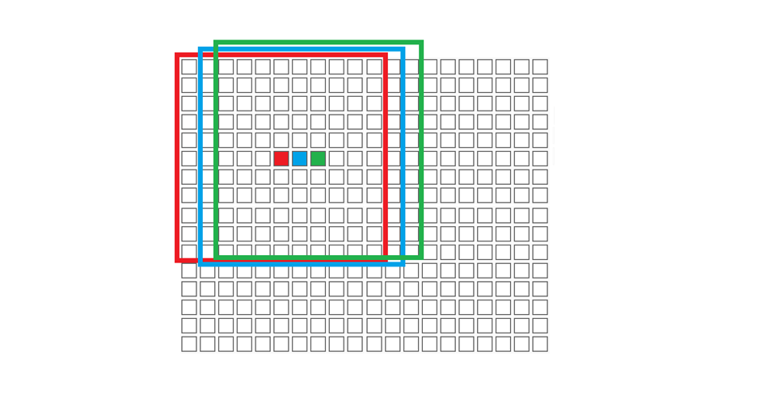
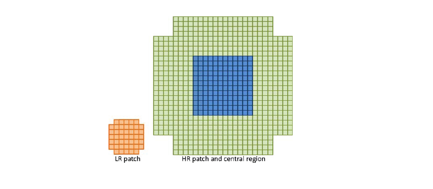

# Implementation Details

算法实现总体包括训练和生成超分辨率图片两部分。

首先需要大量的lr patch和对应的hr patch进行训练，要找出他们之间的变换关系，即找出系数矩阵。同时，由于不同类型的patch对可能对应着不同的features，因此不应该对所有的patch逗是用同样的关系矩阵。因此，需要涉及到聚类，将lr patch通过聚类分成不同的feature类型，找到每一个聚类的关系矩阵。在实际使用时，通过将低分辨图片中的patch分类（即计算它与哪一个聚类中心的欧氏距离最小），来使用相对应的系数矩阵计算hr patch。利用所有得到的hr patch，就可以构造出新的高分辨图像。

## Train

训练部分分为三个脚本：

- `getAllPatches.m`。用于在训练集中提取所有的lr和hr patches，并存储。

- `trainClusters.m` 。用于将上一步提取到的所有lr patches聚类。

- `trainCoefMatrix.m` 。用于获取每一个聚类对应的系数矩阵。

主要参数：

```matlab
sigma = 1.2; % 规定生成高斯卷积核的sigma值
lr_p_size = 7; % lr patch的大小为7*7
lr_center_size = 3; % lr patch的中心区域为3*3
scale_f = 3; % 放大倍数为3
num_of_patch_to_cluster = 700000; % 共提取70w样本lr patch用于聚类和训练
num_of_hr_patch = 700000; % 相应的hr patch数量也是70w
lr_patch_pixels = lr_p_size^2 ‐ 4; % lr patch为45维
hr_patch_pixels = (lr_center_size * scale_f)^2; % hr patch为81维
```

### getAllPatches

主要步骤如下：

1. 从Train文件夹中读取图片，并提取lr patch和hr patch。由于算法只针对Y通道，因此需要对训练集图片先转
   换到YCbCr空间，并提取Y通道。

2. 将每张图片的Y通道，输入函数`[ hr_patches, lr_patches ] = getPatchFromHR( hr_img_y, sigma, scale_f, lr_p_size, lr_center_size )` 。首先，会通过`generateLRimage( img_y, sigma, scale_f )` 得到trim_img和lr_img，trim_img是把原来的高分辨率图片切去了边角（至多2个像素的宽度），来保证高度和宽度能够被3整除，这样便于lr patch和hr patch在切割时能一一对应。之后，使用bicubic下采样得到lr_img并模糊，最后，返回的lr_img是经过高斯模糊的。

3. 得到trim_img和lr_img后，lr patch的切割方式如下图：

   

   hr patch的切割同理，只是lr patch的步长为1，相应的，hr patch切割时的步长为3，这样保证每一对patches是对应的。切割出来的lr和hr patch如下（由于在实验中放大系数为3，因此对应的，hr patch的大小是21x21，中心的大小为9x9。

   

   切割完成后，还要相应的减去lr patch的均值，并reshape。此时，返回的hr_patches是81xN的矩阵，lr_patches是45xN的矩阵（N为这幅图片中切割出的所有lr-hr patch的对数）。

4. 由于如果这样处理训练集中所有的图片，会得到超过700w个patch对，于是随机选出其中的70w对，即在每一张图片中按照70/700的概率来选取patch。为了满足后续聚类时kmeans的需要，每一个patch需要经过转置后，再进行存储。最后，得到最终需要的两组数据：

   - patch_to_cluster ——700000*45的矩阵，即所有用于聚类的lr patch。
   - all_hr_patches ——700000*81的矩阵，根据索引是和patch_to_cluster中的lr patch一一对应的。

### trainCluters

主要利用**kmeans**函数实现：

```matlab
[clus_idx, clus_mat] = kmeans(patch_to_cluster, num_of_clusters, 'Display','iter', 'MaxIter', 200, 'emptyaction', 'drop');
```

这里num_of_clusters设置为512，即需要得到512个聚类中心。最大迭代次数设置为200。
返回的clus_idx是一个700000x1的向量，标记了patch_to_cluster中每一行属于哪一个聚类。clus_mat是一个512x45的向量，存储了所有的512个聚类的坐标。

### trainCoefMatrix

对于每一个聚类，计算其变换系数矩阵。

1. 对于第k（k属于[1,512]）聚类，利用clus_idx，从patch_to_cluster中提取出所有属于k聚类的patch对，所有lr patch（经过转置）存储于V中，所有hr patch（经过转置）存储于W中，并计算该类中共有patch对的数量num_of_pair。此时，得到的V为45*num_of_pair的矩阵，W为81*num_of_pair的矩阵。

2. 首先对V补一行全1的向量，使V成为46*num_of_pair的矩阵。之后，我们的目的是，计算出`W = C * V`中的C，因此，经过以下推算：

   ```matlab
   W = C * V ==>
   W * V' = C * V * V' ==>
   W * V' * INV(V * V') = C * V * V' * INV(V * V') ==>
   W * V' * INV(V * V') = C
   ```

   即可得到以下代码实现：

   ```matlab
   C = (W * V') / (V * V');
   ```

   于是，就得到了当前这个聚类k对应的系数矩阵。

3. 对于每一个聚类，重复以上步骤，即可得到所有聚类对应的系数矩阵。注意，当某个聚类的num_of_pair小于46，即会出现秩不足的情况下，不计算这个类的系数矩阵，后续处理时，直接采用双线性插值的方式上采样。

4. 最后，得到两组数据：

   - all_coef_matrix —— 81x46x512的三维矩阵，存储了所有类的系数矩阵。
   - cluster_patch_count —— 512x1的向量，表示每一个聚类的patch数量


## Generate

生成超分辨率图片的部分位于`SRthisImgae.m`，用于处理一张图片lr_img。

1. 和训练前的处理一样，首先判断图片深度，如果是RGB图，需要先转为YCbCr空间，并提取Y通道，保留CbCr通道。之后将其输入函数`getTestLRpatches()`进行lr patch的提取。

2. `getTestLRpatches()`对于输入的lr图片，首先进行延拓，并高斯模糊，之后才开始切分提取lr patch。切分lr patch时，使用的方法和训练时的切分相同，切步长也为1，最后再减去均值。该函数返回值为lr_patches（45xn矩阵，n为这张图片切分得到的lr patch数量）和mean_iten（1xn矩阵，每一个patch的平均强度，用于后续加在得到的hr patch上）。

3. 之后将lr_patches输入函数`getClusterIndex()`，用于计算这个patch矩阵中的每一个patch分别属于哪里一个聚类，即计算它们的**欧式距离**，找到最小值所在的坐标。其中用到简单的矩阵运算即可，返回值为cluster_indexes（1xn矩阵，n为lr_patches长度）。

4. 利用得到的lr_patches和cluster_indexes，可以开始计算超分辨图的Y通道了。遍历lr_patches中的每一个lr patch，根据cluster_indexes找到它所属聚类，并获取该聚类对应的coef matrix，计算对应的hr_patch：

   ```matlab
   this_lr_patch = [this_lr_patch; 1];
   hr_patch_vec = this_coef_matrix * this_lr_patch;
   ```

   注意，当该类的patch数量小于46时，不会使用系数矩阵来计算hr patch，而是直接对lr patch进行上采样（使用**bilinear interpolation**)。

   得到一个hr_patch后，将它恢复成二维的矩阵，叠加到hr_img_y上。并用value_count矩阵来计算某个坐标上叠加了多少个值：

   ```matlab
   hr_img_y(hr_start_h : hr_start_h+hr_center_size‐1, hr_start_w : hr_start_w+hr_center_size‐1)
   = hr_img_y(hr_start_h : hr_start_h+hr_center_size‐1, hr_start_w : hr_start_w+hr_center_size‐
   1) + hr_patch_mat;
   value_count(hr_start_h : hr_start_h+hr_center_size‐1, hr_start_w :
   hr_start_w+hr_center_size‐1) = value_count(hr_start_h : hr_start_h+hr_center_size‐1,
   hr_start_w : hr_start_w+hr_center_size‐1) + one_mat;
   ```

5. 所有的hr patch叠加完成后，取得每个像素点的平均值：

   ```matlab
   hr_img_y = hr_img_y ./ value_count;
   ```

   就得到了超分辨图片的Y通道。最后，直接对CbCr通道利用**bicubic interpolation**上采样，再将三个通道合并，转成RGB，输出即可得到超分辨图片。

